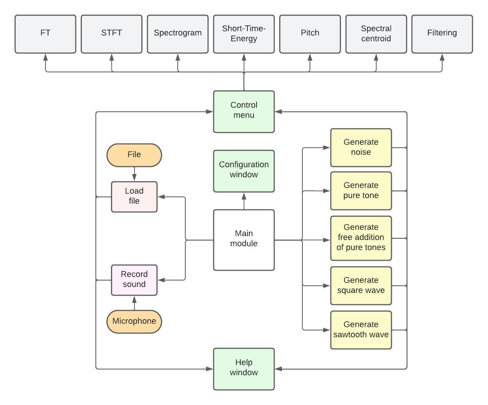
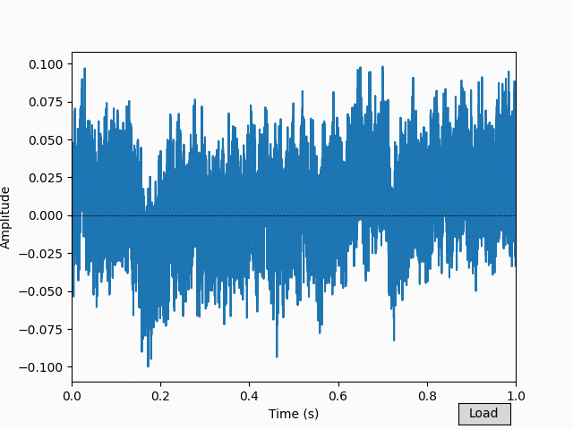
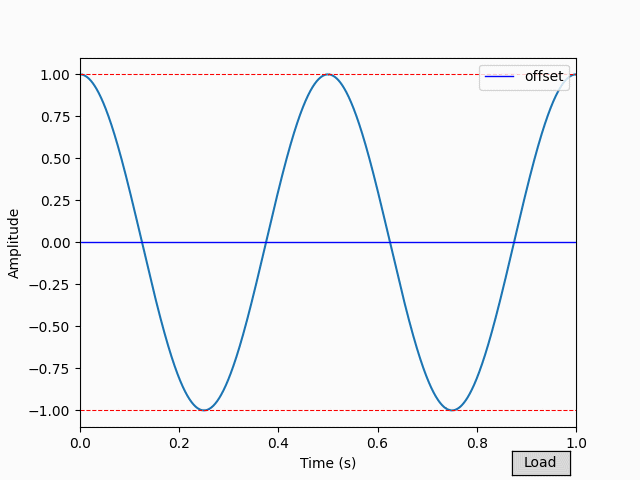
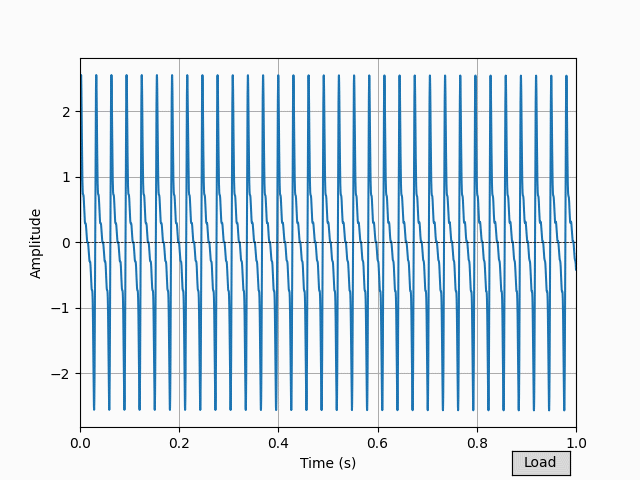
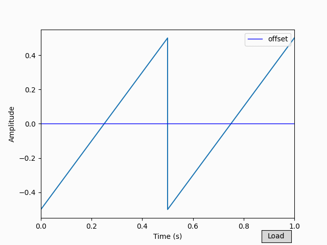

# Signal Visualizer: introducing singal processing concepts into musical education

## Description

Signal Visualizer is an application for musical education. It aims to show which are the most used frequency analysis techniques in a visual and interactive way. This application allows the following functions:

* Generation of signals.
* Imports of sounds.
* Recordings of new sounds.
* Visualization of frequency analysis techniques.

It also contains user assistance and customization of the application.

The following image shows an schema of the architecture of the application:



As depicted in the figure, the solution comprises a set of subsidiary modules that depend on a main module. Based on their functionality, the modules are classified into the following types:

* **Main module**: The primary interface of the application. It provides access to other modules.
* **Generation modules**: These modules create a selection of synthetic sound signals for loading into the control menu window.
* **Input modules**: They serve to load real audio into the control menu window, whether audio files or recordings made in real-time.
* **Control menu module**: It allows to configure the parameters of different frequency analysis techniques and visualize the results.
* **Help module**: It displays user assistance for each module.
* **Configuration module**: It enables customization of the color of the spectrogram.

The main module is positioned at the center of the diagram and is responsible for executing the other modules, as represented by arrows originating from it. When the
user generates an audio signal via generation or input modules, they can always load it into the control menu window to analyze it. The help module is accessible from any generation and import module, as well as from the control menu module.

## Visuals

The software can generate the following signals: pure tone, free addition of pure tones, square wave, sawtooth wave, and three types of noise. These modules have the objective of generating synthetic signals so the student can learn under which parameters they are calculated, and how the change of each parameter affects the resulting signal.










## Installation

Execute the file **setup.py** to obtain an executable of Signal Visualizer.

```bash
python setup.py
```
Then an executable called **signalvisualizer.exe** will be created into the **build** folder. Put the executable and the **csv**, **html**, **icons**, **library**, and **wav** folders in a separated folder. Now the executable should work.

## Usage

To run the application from a terminal, after installing all the requirements in **requirements.txt** use:

```bash
python signalvisualizer.py
```

## Authors and acknowledgment

This application has been developed by Leire Varela Aranguren under the supervision of Inma Hernáez Rioja.


